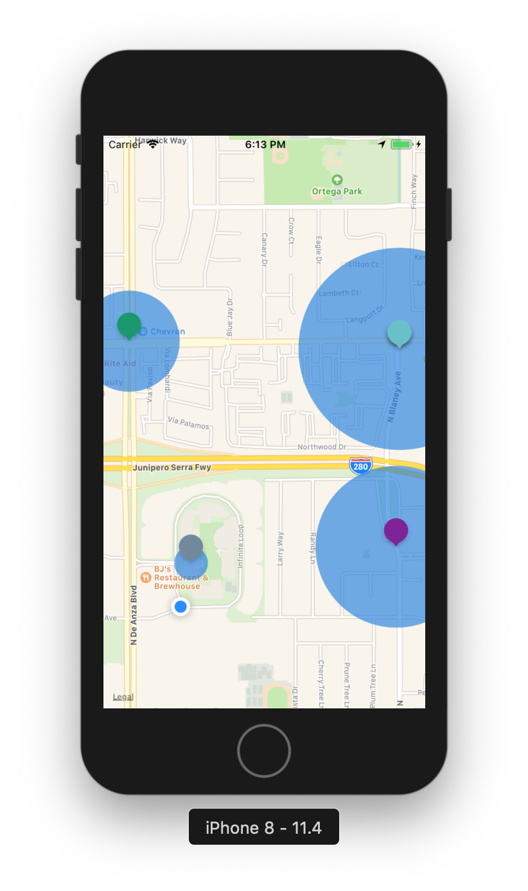
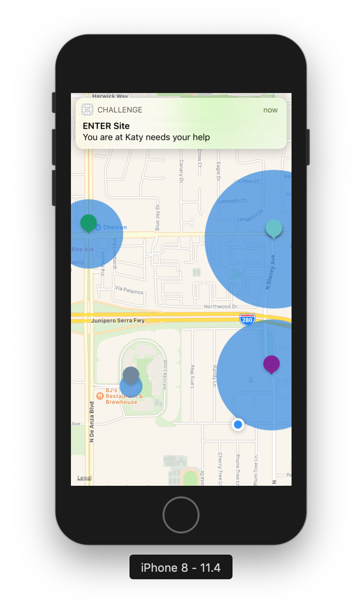

# Hubstaff's Mobile Challenge
The goal of this exercise is to assess candidates' mobile development skills.

This project can be implemented in Objective-C (iOS) or Java (Android). Feel free to use the one you're most comfortable with.

There are multiple correct ways to implement a solution for this challenge. Try to keep your solution as simple as possible. You can use comments or write in the PR if you want to show or explain how your solution could be extended.

## Project Description
At Hubstaff, we're building a time tracking mobile app for [iOS](https://apps.apple.com/us/app/hubstaff-time-clock/id971894122) and [Android](https://play.google.com/store/apps/details?id=com.netsoft.Hubstaff&hl=en&gl=US). 

We've recently been expanding the functionality of our application to serve a larger audience. Specifically, we want to be able to help our clients manage teams of field workers.

One of the new features our clients have asked for is the possibility to have their employees check in at job sites via the mobile app. Suppose an electrical contracting firm receives a request from a customer to have an electrician fix something. We want to allow the electrician to check in at the job site when he/she gets there. 

The challenge proposed is to implement the UI and the functionality for that feature. Use the screens below to guide your implementation.




The data for the active job sites should be fetched from the following url address:
[https://run.mocky.io/v3/60fc94d9-db13-4f00-bda4-523f1ba6b4aa](https://run.mocky.io/v3/60fc94d9-db13-4f00-bda4-523f1ba6b4aa)

Here's an example of the structure of the response:
```
{
  "sites":
  [
    {
      "id": "544",            
      "name": "Katy needs your help",
      "latitude": "37.332138",
      "longitude": "-122.023330",
      "radius": "240",
      "color": "#821a9a"
    }
  ]
}

```

**Please note:**
- There's no need to deal with HTTP errors as server will always return 200 OK
- Use the "City Bicycle Ride" iOS simulator mode for simulating location (the test data is tied to this route). The GPX file can be downloaded here: [https://github.com/dive/ios-simulator-scenarios-to-gpx/blob/master/gpx/City%20Bicycle%20Ride.gpx](https://github.com/dive/ios-simulator-scenarios-to-gpx/blob/master/gpx/City%20Bicycle%20Ride.gpx)

## Requirements
- UI matching the image above
- Notification when the user crosses the site border (center + radius)
- Tracking and displaying the user's location
- Support for both landscape and portrait orientations
- Optimized for battery usage

## Functional Requirements:
- The application should have a single screen - the Map screen
- The Map screen should show all available sites
- Once the sites are fetched - zoom the map in order to show all sites
- The site should be shown as a colored “marker” (the simplest way possible) with the radius circle
- Current user location “marker” is shown on the map (the simplest way possible)
- When the user enters or exits a site area, the system notification with the appropriate text pops up:
  - On Enter notification text: "You are at <site_name>"
  - On Exit notification text: "You left <site_name>"
- The notifications should pop up in the foreground and in the background

#### Bonus (TBD)
- Show a text with last known location
- Mockup: https://www.screencast.com/t/oHENxxaXO
- Text updates if location was changed for more than 500m
- Text format: “Last known: &lt;latitude&gt; / &lt;longitude&gt;”

## Stack
If you build the app for iOS:
- Allowed Languages: Objective-C, C++
- IDE: XCode
- Min. iOS version: 12

If you build the app for Android:
- Allowed Languages: Java, C++
- IDE: Android Studio
- Min. API version: 23

## Submission
Please clone the repository and create a private repository on your own account. Then, implement your proposed solution and provide access to the repo for the following github users:
- @miguelcdpmarques
- @sergeykrasnozhon
- @ayarotsky

## Evaluation Criteria
We'll be looking at the following criteria when assessing candidate submissions:
- Project architecture
- Code simplicity and clarity
- Git history, including comments in the PR

**Good luck!**
